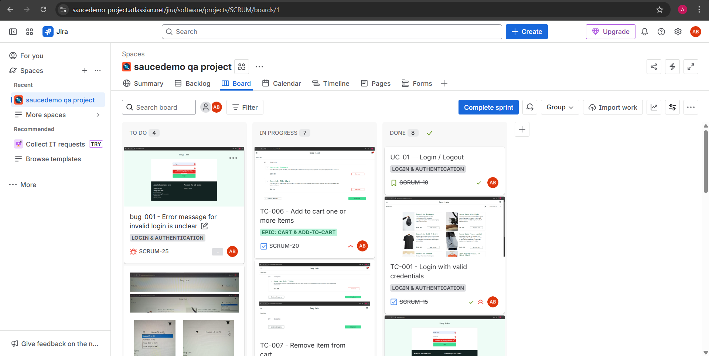
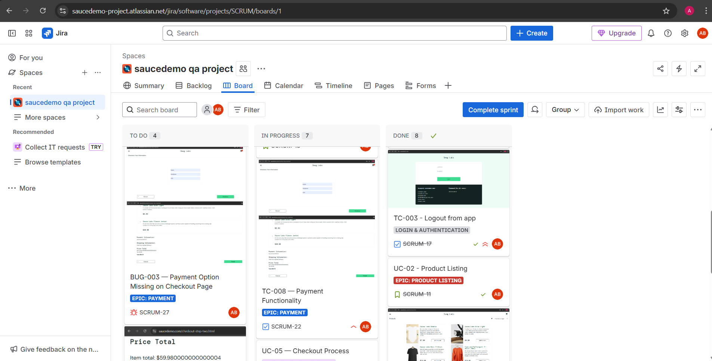
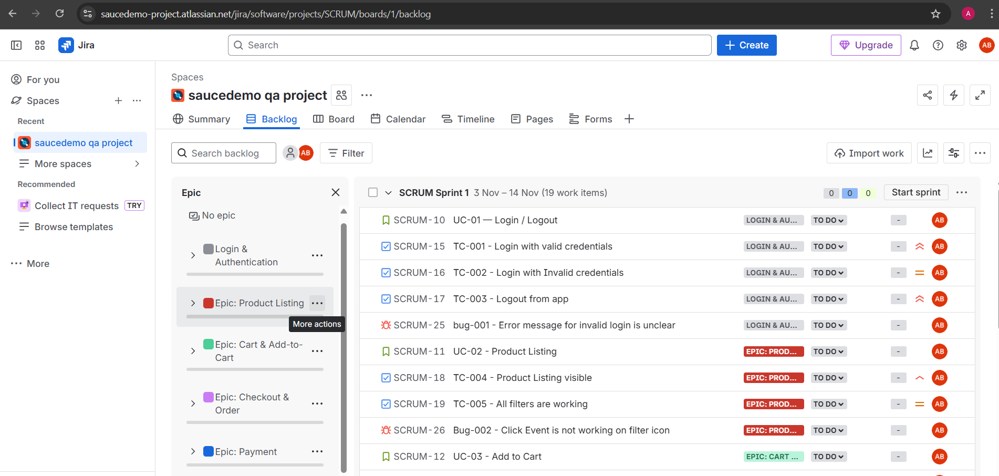
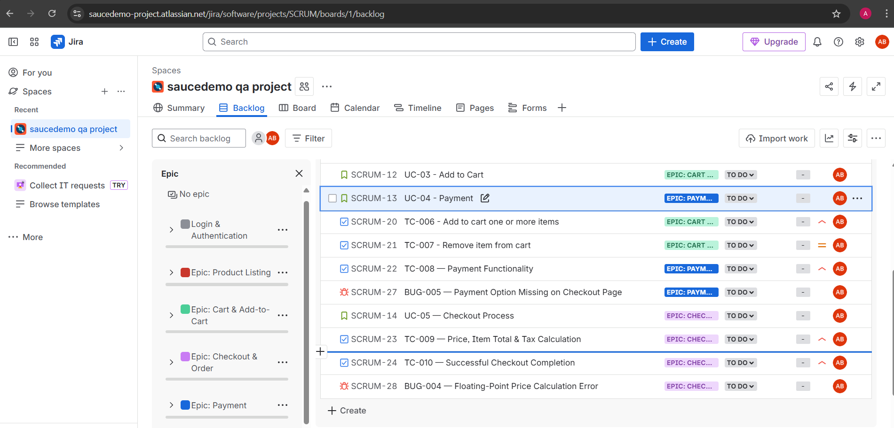

# QA SauceDemo Project

This project represents manual testing performed on the SauceDemo web application. 
It includes requirement analysis, test case creation, test execution, bug reporting, and Jira task management.

---

## Project Overview

SauceDemo is an e-commerce demo website used to practice software testing.  
The main objective of this project is to demonstrate the complete QA workflow, including:

- Understanding application requirements
- Preparing test documentation
- Writing and executing test cases
- Reporting bugs with proper evidence
- Tracking work items using Jira
- Preparing final test summary reports

---

## Tools and Technologies Used

- Jira Software (Task management and bug tracking)
- Confluence or Google Docs (Documentation)
- Excel/Google Sheets (Test cases and reports)
- Windows 11
- Chrome Browser

---

## Scope of Testing

The following modules were tested:

- Login functionality
- Inventory / Products page
- Add to Cart
- Cart page functionality
- Checkout: Step 1 and Step 2
- Payment and Order Completion flow
- UI validation
- Negative testing
- Regression testing

---

## Test Documentation

### 1. Requirements Understanding Document
Contains analysis of the SauceDemo application and its workflows.

### 2. Test Plan
Includes:
- Testing approach
- Objectives
- Entry and exit criteria
- Testing types
- Tools used
- Risks and assumptions
- Deliverables

### 3. Test Cases
Covers:
- Functional test cases
- UI test cases
- Negative test cases
- Boundary scenarios

Each test case includes:
- Test ID
- Test scenario
- Preconditions
- Steps to reproduce
- Expected result
- Actual result
- Status

### 4. Bug Reports
Includes:
- Bug ID
- Severity
- Priority
- Steps to reproduce
- Environment details
- Expected vs actual result
- Screenshots

### 5. Test Summary Report
Summarizes:
- Total test cases executed
- Passed and failed counts
- Bugs logged
- Overall quality evaluation
- Final conclusion

---

## Jira Workflow

The following items were created in Jira:

- Epics (Test plan objective)
- Stories (Usecases)
- Tasks (Testcases)
- Bugs (bug report)

---

## Jira Project Evidence

Below are the screenshots showing project tracking in Jira:

1. **Backlog View**
   - 
   - 

2. **Board view**
   - 
   - 

3. **sprint view**
   - 
   - 

4. **sprint completed view**
   - 
   - 

3. **summary view**
   - 
   - 

---

## Folder Structure

QA-Saucedemo-Project/
│
├── Bug Report/
├── docs/
|   ├── usecases/ 
│   ├── requirements.md
│   ├── stlc.md
│   └── testplan.md
|
├── evidence/
|   ├── screenshots/
│   ├── JIRAscreenshots/
|
├── TestSummary/
├── TestCases/
└── README.md

---

## Conclusion

This project demonstrates a complete manual QA process followed in real-world software testing environments.  
It includes proper documentation, test execution, defect reporting, and Jira task management.